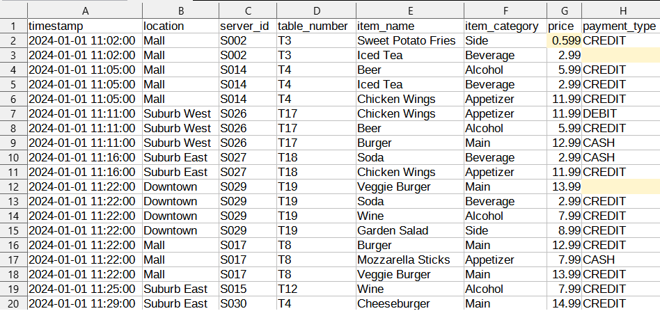
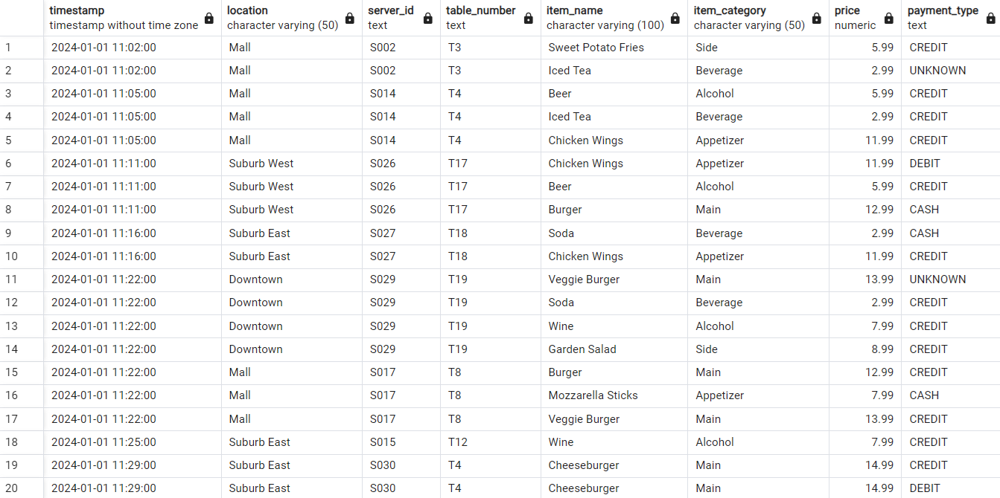
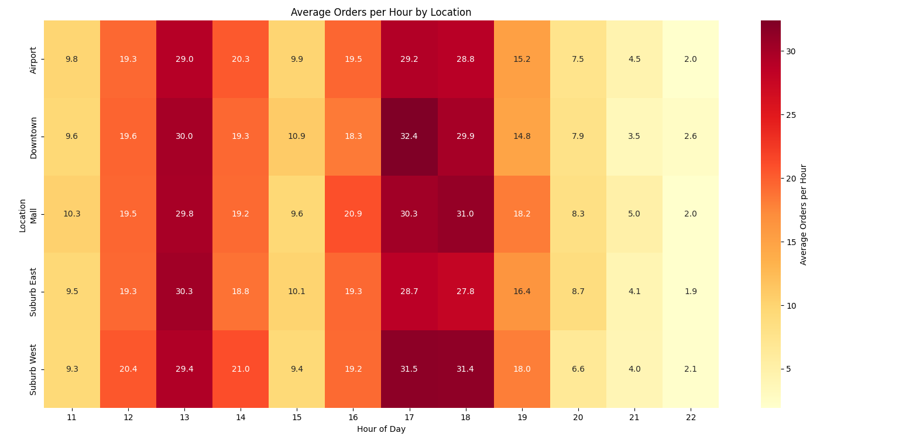
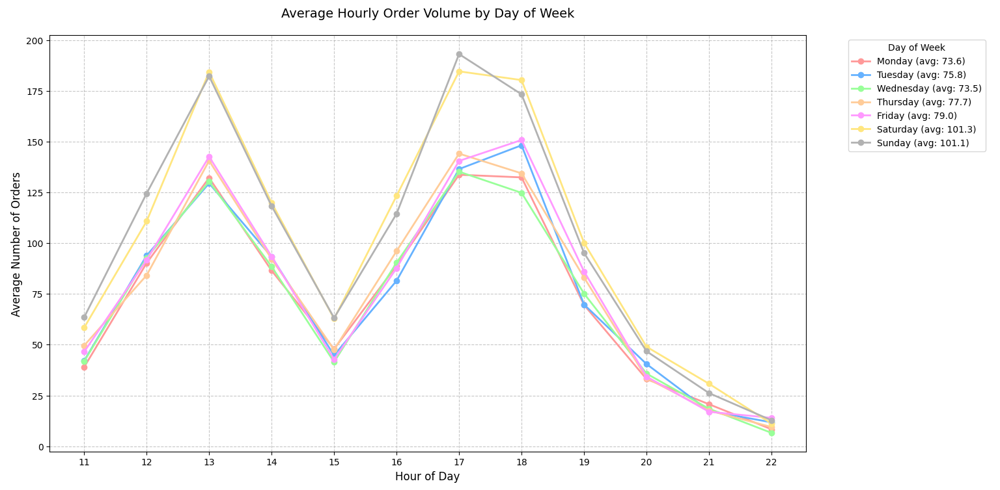
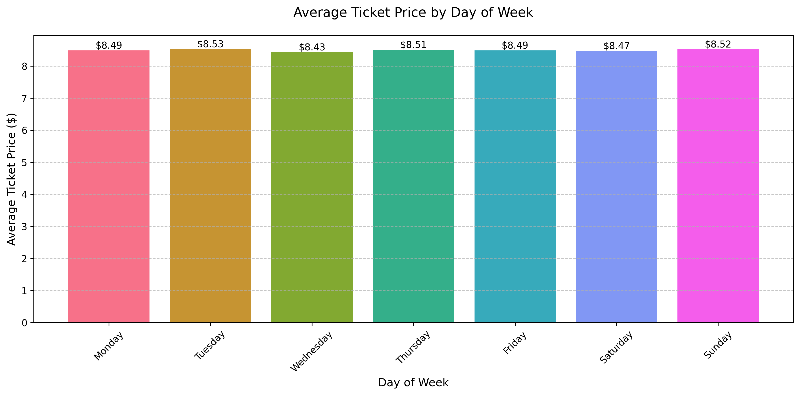

# Restaurant POS Data Analysis - Comprehensive Report

## Introduction

In the dynamic field of data analytics, the ability to clean, process, and derive insights from Point of Sale (POS) data is a crucial skill for businesses in the restaurant industry. This portfolio project demonstrates my proficiency in data cleaning techniques, synthetic data generation, and data visualization, using a restaurant chain's POS system as a case study.

While real restaurant data would typically be ideal for such analysis, working with synthetic data offers unique advantages for skill development and demonstration. This project intentionally generates POS data with common real-world issues—missing values, price inconsistencies, duplicate transactions, and varying patterns in customer behavior—providing an excellent opportunity to showcase data cleaning methodologies without compromising sensitive business information.

The analysis spans several key areas: First, I detail the process of generating and cleaning synthetic POS data, highlighting common challenges in restaurant data management. Then, through a series of visualizations including heatmaps and time-series analyses, I explore operational patterns such as peak hours, location-specific trends, and daily order volumes. Each visualization serves a specific analytical purpose, from identifying staffing needs to understanding customer behavior patterns. This project leverages modern AI tools, specifically Claude 3.5 Sonnet by Anthropic, to augment the data analysis process, demonstrating how AI assistance can enhance data cleaning and analytical workflows while maintaining human oversight and domain expertise.

Throughout this portfolio piece, I employ various technical tools including Python (with Pandas, Matplotlib, and Seaborn), SQL, and data cleaning techniques. While the synthetic nature of the data sometimes limits the depth of business insights, the project effectively demonstrates the technical processes and analytical methodologies essential in real-world data analysis.

## Data Cleaning Analysis

**Before Cleaning:**

**After Cleaning:**

### Synthetic Data Generation

One of the primary goals of this project was to refine my data cleaning skills. In order to do this, synthetic data generation was necessary. The ability to generate synthetic data facilitates training and education using realistic but non-sensitive data, enables development and testing without exposing sensitive customer data, enables validation of error handling and boundary conditions, and allows testing of system behavior under extreme conditions.

The particular data set I generated detailed POS (point of sale) information, including the following characteristics:

1. Time Period: 90 days (about 3 months)
2. Orders per Day: ~300-400 orders
3. Items per Order: 1-5 items
4. Multiple Fields per Record: 
    - Timestamp 
    - Location 
    - Server_id 
    - Table_number 
    - Item_name 
    - Item_category 
    - Price 
    - Payment_type

### Data Generation and Cleaning Process

I created a Python script that generated realistic POS data with common issues one would encounter in real restaurant data:
1. Missing server IDs and table numbers 
2. Occasional price errors (obviously wrong amounts) 
3. Missing payment types 
4. Duplicate transactions 
5. Realistic patterns in: 
    - Busier weekend days 
    - Peak hours during lunch and dinner 
    - Varying order sizes 
    - Server assignments 
    - Menu item selection

I created a CSV file, which reflects a common real-world format, then converted this to an SQL table, which would allow me to run SQL queries to understand the issues with the data and clean it successfully. 

Instead of starting with cleaning the entire 3-month dataset, I decided to first focus on a subset of 1 day of data, then scale the cleaning code to the full dataset. Initially working with a subset of data is a common practice in data science, favored for its efficiency. For me, it was beneficial because: 

- It was ideal for testing and refining my SQL queries 
- It was easier to verify that my calculations were correct 
- I could spot data quality issues more easily 

Through numerous SQL iterations I was able to: 
- Identify and handle missing values 
- Detect and remove duplicate records  
- Fix obvious price errors  
- Standardize data formats 

After cleaning the subset, I applied the same SQL queries to the larger dataset. One thing I realized I had missed was the fact that there were still subtle variations in prices for the same item. For example, cheeseburger was listed as 14.99, 14.99000001, and 15.00. After using SQL queries to make the prices consistent at 14.99, the process was complete. Here's a brief analysis of the cleaned dataset. 

1. No price anomalies returned (confirming successful price cleaning)
2. Missing Data Analysis: 
    - Total Records: 89,562 
    - Unknown Servers: 4,708 (5.26%) 
    - Unknown Payments: 4,458 (4.98%) 
    - Unknown Tables: 2,854 (3.19%). These percentages were consistent across the full dataset and similar to what I saw in the 1-day sample. 
3. Basic Statistics: 
    - Total Transactions: 89,562 
    - Locations: 5 (consistent with the sample) 
    - Servers: 30 (excluding 'UNKNOWN') 
    - Menu Items: 12 (consistent with the sample) 
    - Average Price: $8.83 (very close to the sample's $8.79) 
    - Total Revenue: $791,177.38 (about $8,790 per day average) 

The cleaned data proves reliable because:
- No price anomalies remain 
- Missing data percentages were reasonable and consistent 
- The basic statistics aligned with what I saw in the sample 
- All numbers were within expected ranges 

Having confirmed the cleaning was successful, I was able to proceed with the analysis.

## Heatmap Analysis

This heatmap shows the average number of orders by hour and location. To create this, I utilized Python, Pandas, Seaborn, and Matplotlib. I chose a heatmap because it allows one to assess a wide spectrum of data at a glance, with larger numbers represented by darker red shades, and lower numbers represented by lighter yellow shades. 

Assuming this were real and not synthetically generated data, we would be able to draw a number of important insights from this chart: 

### Peak Hours Analysis
- 29.7 average order volume at 1 pm
- 30.1 average order volume at 5 and 6 pm
- 9.98 average order volume at 3 pm
- Peak hours have 3x increased order volume of off-peak hours

### Location Patterns
- Lunch Peak (1 pm): Suburb East leads with average 30.3 orders/hour
- Dinner Peak (5-6 pm): Downtown peaks at 32.4 orders/hour at 5 pm, while Suburb West leads the dinner period with 31.45 average orders per hour
- Volume Changes: Suburb West shows 7% dinner increase, Downtown shows 3.8% dinner increase, while Suburb East uniquely shows 6.7% dinner decrease
- Airport and Mall maintain consistent volumes between lunch and dinner periods

### Staffing Recommendations
- Increase staff at Suburb West by 7% between 5-8 pm
- Increase staff at Downtown by 4% between 5-8 pm
- Reduce staff at Suburb East by 7% between 5-8 pm
- Maintain equal staffing levels at lunch and dinner at Airport and Mall

In a true scenario without the use of synthetic data, one might expect a higher variation of average order number among locations and thus more meaningful insights. However, since this data was primarily for cleaning and chart demonstration, we can conclude that the data fulfills its purpose.

## Hourly Order Volume Line Chart Analysis

This line chart shows the average hourly order volume among all restaurants collectively by day of the week. To create this chart I used Python along with Pandas, Matplotlib, and Seaborn. 

From the chart, we can see there is an afternoon slump at 3 pm, which roughly matches the same volume of the first hour, as well as peaks at 1 pm and the 5 and 6 pm period. The last couple hours between 8 and 10 pm see the lowest volume of the day. These patterns align with what we observed in the heatmap.

### Notable Observations
- An unusual dip in volume occurs on Wednesday and Thursday at 6 pm unlike other days at this hour
- Monday and Wednesday have the lowest average orders by hour with 73.6 and 73.5 respectively, which is 27% lower than the weekend
- Weekdays average 75.92 orders per hour, while weekends average 101.2 orders per hour (33.3% higher)

The primary recommendation based on these observations is that staffing levels should be 33% higher on weekends. 

These patterns reflect expected variations in restaurant traffic, with higher volume at lunch and dinner time as well as weekends. This chart successfully demonstrates an effective visualization of volume, creating a clear lens for spotting changes and anomalies that restaurant chain owners can use to adapt their operations.

## Average Ticket Price By Day of Week Analysis

This chart effectively demonstrates the limitations of generating synthetic data. We can see that the day with the lowest average ticket price, $8.43 on Wednesday is only 9 cents from the average ticket price of the highest day, which is Sunday at $8.52. This lack of variation is extremely unrealistic. In real restaurant operations, you typically see more significant variations because: 

- Weekends often have higher average tickets due to more alcohol sales and dinner service 
- Weekday lunch rushes tend to have lower average tickets due to quick service and lunch specials 
- Different customer demographics visit on different days

Thus we cannot draw any meaningful conclusions, even as a hypothetical analysis. 

Implementing such detailed variations in our synthetic data could have created more realistic results. For example, we could have considered:  
- Adding day-specific menu items (e.g., "Sunday Brunch Special") 
- Implementing different item selection probabilities by day 
- Varying the ratio of alcohol to non-alcohol sales by day 
- Including "happy hour" effects on specific days

While implementing such detailed variations would be beneficial in teaching data analysis, for my purposes of demonstrating data cleaning and visualization techniques, this level of complexity was unnecessary. 

Despite the limitations of the data, my choice of a bar chart is appropriate for this analysis because: 
- It clearly shows the relative differences between days 
- Color coding by day helps with quick visual interpretation 
- Bar charts work well for categorical comparisons

## Conclusion

The previous chart leads me to my conclusion that even though the synthetic data served its purpose in this project, it is much more satisfying to work with real data, which allows one to garner insights that synthetic data does not. However, even with synthetic data, we were able to identify valuable operational insights: A restaurant could optimize staffing by adjusting worker hours to match the 33% higher weekend volume we identified. Additionally, by aligning staffing with peak hours (3x normal volume), restaurants can minimize lost sales due to understaffing while avoiding excess labor costs during slower periods. 

With authentic data, several additional analyses would be possible:
- Server Performance: Average ticket size and table turnover rates
- Space Utilization: Most profitable table locations and seating configurations
- Kitchen Operations: Order timing patterns and prep planning optimization
- Customer Behavior: Regional preferences and payment type trends

This project successfully demonstrated both data cleaning techniques with AI augmentation and the relative benefits and limitations of synthetic data generation.

## Contact
For collaboration opportunities, please reach out via symmetry1@live.com

© 2025 Heath Hoppus