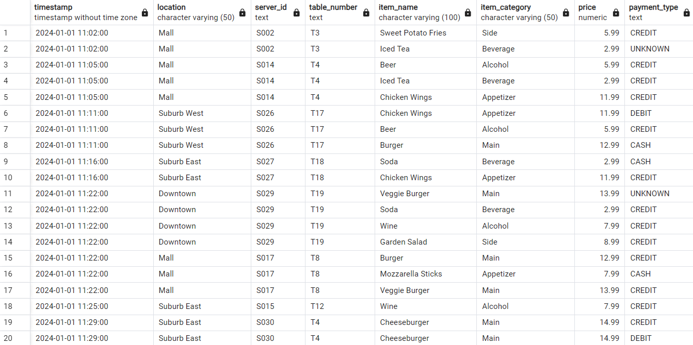

# Restaurant POS Data Analysis Project

## Overview
This project demonstrates advanced data cleaning, processing, and visualization techniques using restaurant Point of Sale (POS) data. Using Python, SQL, and modern AI tools including Claude 3.5 Sonnet, I analyzed operational patterns to derive actionable business insights for restaurant management.

## Data Cleaning Process
The project began with raw POS data containing common real-world issues such as missing values, price inconsistencies, and duplicate transactions. Through systematic cleaning and validation, I transformed this raw data into a reliable dataset for analysis.

**Before Cleaning:**


**After Cleaning:**


Key cleaning steps included:
- Standardizing price formats and correcting anomalies
- Handling missing server IDs, payment types, and table numbers
- Removing duplicate transactions
- Converting data to SQL format for efficient querying

## Key Visualizations and Insights

### 1. Order Volume by Location and Hour


**Key Findings:**
- Peak hours show 3x higher order volume than off-peak periods
- Distinct patterns between lunch (1 PM) and dinner (5-6 PM) peaks
- Location-specific trends inform staffing needs

### 2. Daily Order Patterns


**Key Findings:**
- Weekend order volumes average 33% higher than weekdays
- Consistent afternoon lull across all locations at 3 PM
- Clear peak periods during lunch (1 PM) and dinner (5-6 PM)

### 3. Average Ticket Analysis


This visualization demonstrates the importance of working with real data for certain analyses, as synthetic data may not capture true variations in customer behavior patterns.

## Business Impact
The analysis revealed several actionable insights for restaurant operations:
- Optimize staffing by adjusting worker hours to match 33% higher weekend volumes
- Align staffing with peak hours (3x normal volume) to balance service quality and labor costs
- Adjust location-specific staffing based on unique lunch and dinner rush patterns

## Tools & Technologies Used
- Python (Pandas, Matplotlib, Seaborn)
- SQL
- Claude 3.5 Sonnet for AI-augmented analysis
- Data Visualization Libraries

For detailed analysis methodology and findings, see `ANALYSIS.md`.


## Project Structure
```tree
restaurant-analysis/
├── .gitignore
├── .env
├── README.md
├── ANALYSIS.md
├── LICENSE
├── requirements.txt
├── images/
│   ├── POS_CSV_pre-cleaning.png
│   ├── POS_SQL_post_cleaning.png
│   ├── order_per_hour_heatmap.png
│   ├── daily_hourly_patterns.png
│   └── daily_average_tickets.png
└── src/
    ├── utils.py
    ├── generate_pos_data.py
    ├── ave_ticket_by_day_2.py
    ├── heatmap_2.py
    └── each_day_hourly.py
```


## Contact
For collaboration opportunities, please reach out via symmetry1@live.com

© 2025 Heath Hoppus

## License
This project is licensed under the MIT License - see the LICENSE file for details.
